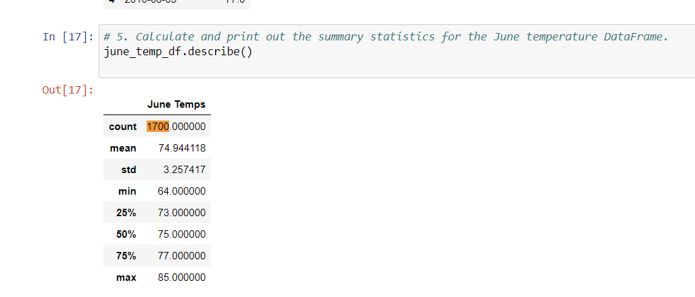
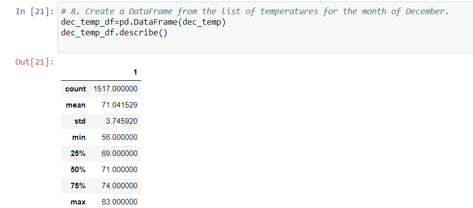

# Surfs_up

## Overview of the analysis:

A shop which will serve surfboards and icecreams to locals and tourists is a business idea. 
This requires an investement however investor is concerned about the weather condition  
So investor asks if we can run analytics on weather dataset where we would like to open the shop
Therefore we will use Pandas, SQlite and Python.

## Results: 

### June Temperature

### December Temperature

### Summary: 
Include 2 queries at the end 

Calculate and print out the summary statistics for the Decemeber temperature DataFrame.
session.query(func.count(Station.station)).all()

dec_prep =  session.query(Measurement.date, Measurement.prcp).filter(extract('month', Measurement.date) == 6 ).all()
print(dec_prep)
